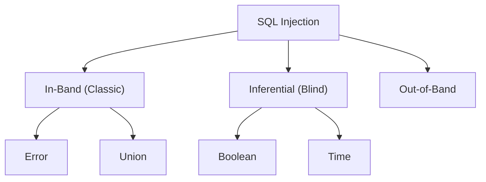

# SQL Injection

SQL injection happens when the application submits a textual
SQL query to the DB engine for processing
by means of simple string concatenation, **embedding 
UNTRUSTED data**.

The problem is that there is no separation between DATA 
and CODE. Furthermore, the embedded data is neither checked
for data type validity nor subsequently sanitized.

Thus, the untrusted data (where you might expect a user's
information, countries, etc.) could contain SQL commands, or
or modify the intended query. The database would
interpret the altered query and commands as if they
originated from the application as its normal operation,
and execute them accordingly.

> The attacker can exploit this vulnerability either by
modifying the URL, or by submitting malicious data in the
user input or other request fields.

> SQL Injection impacts all of the CIA (Confidentiality, Integrity and Availability)
SQL Injection can lead to REMOTE CODE EXECUTION on the OS


## Basic Example: Bypassing Authentication

The Attacker sends: `admin'--``

The following SQL query is then built:  
```sql
SELECT * FROM users WHERE username = 'admin'--' AND password = admin_password;
```

## General Recommendations

- Validate all untrusted data, regardless of the source.
- Preferrably, use ORMs (Object-Relational Mappings)
- Validation should be based on a **white list**, rather than
a black list.
- In particular, check for:
    - Data type
    - Size
    - Range
    - Format
    - Expected values
- Adhere to the **Principle of Least Privilege**
- Do NOT use dynamically-concatenated strings to
construct SQL queries.
- Prefer using DB **STORED PROCEDUREs** for all data access,
instead of ad-hoc (on the fly) dynamic queries.
- Use secure db components, such as **parameterized queries**
and **object bindings**. 

### Vulnerable SQL Code

```sql
CREATE OR REPLACE PROCEDURE sp_vulnerable (
    vname IN VARCHAR2
    , vresult OUT VARCHAR2
) AS
    vsql VARCHAR2(4000);
BEGIN
    vsql := 'SELECT name FROM customers WHERE name = ''' || vname || ''''; -- SECURITY RISK!!
END;
/
```

### Safe SQL Code

```sql
CREATE OR REPLACE PROCEDURE sp_example(
    vname IN VARCHAR2
    ,vresult OUT VARCHAR2
) AS
    vsql VARCHAR2(4000);
BEGIN
    vsql := 'SELECT id FROM tbl_customers WHERE name = :1';
    EXECUTE IMMEDIATE vsql INTO vresult USING vname;
END;
/
```

\* Interesting: XML databases can have similar problems:
e.g. XPath and XQuery injection.

# A Common SQL Injection Example with Java

```java
String query = "SELECT account_balance FROM user_data WHERE user name = " 
    + request.getParameter("customerName");

try {
    Statement statement = connection.createStatement(...);
    ResultSet results = statement.executeQuery(query);
}
```

## Primary Defenses

1. Use **Prepared Statements** with Parameterized Queries.
2. Use of Properly Constructed STORED PROCEDURES.
3. White List Validation.
4. (Last Resort) Escaping all user input.

# Basic Defenses against classic SQL injection

## Validate / whitelist Before using a bind

Even when you use binds, validate the incoming value(s).
Example:

```sql
-- after FETCH CURSOR_DULCES INTO A,B,C,D;
IF NOT REGEXP_LIKE(A, '^[A-Za-z0-9\-_]{1,30}$') THEN
  RAISE_APPLICATION_ERROR(-20001, 'Invalid cl_emp value');
END IF;

-- Then use static SQL with bind as above.
```

Why: validation reduces the attack surface and prevents unexpected data shapes (too-long values, control characters, etc.).

# Second Order SQL Injection Example
## PL/SQL Using Database Values in an SQL Statement Can Result in SQL Injection

```sql
IF if_number(p_id) THEN
    vsql_1 := 'SELECT name FROM product WHERE id = ''' || p_id || '''';
    EXECUTE IMMEDIATE vsql_1 INTO p_name;

    vsql_2 := 'SELECT client_id FROM invoices WHERE product_name = ''' || p_name || '''';
    EXECUTE IMMEDIATE vsql_2 INTO client_id;

    DBMS_OUTPUT.PUT_LINE('Client ID = ' || client_id);
END IF;
```

# Types of SQL Injection



1. **In-Band (Classic)** (Easier to exploit)  
The attacker uses the same communication channel to both
launch the attack and gather the result of the attack.
The retrieved data is presented directly in the application
web page.

    1.1 **Error-based SQL injection**: the attacker forces
    the database to generate errors that give out information
    about how the backend is working.

    A single quote can break the query and give out
    too much information:  
    Example. Input = `www.random.com/app.php?id'`  
    Error = "SQL syntax error. Check the manual for MySQL
    Server version x.x.x.x"

    1.2 **Union-based SQL injection:** Takes advantage
    of the `UNION` SQL operator.  
    Example: Input = `www.random.com/app.php?id' UNION SELECT username, password FROM users--`  

    Output:
    ```
    carlos
    afwieusdbv1234
    administrator
    aslicnvakqwjnbrf234
    ```

2. **Inferential (Blind)**  
SQL injection vulnerability where there is no actual breach
of data via the web application. The attacker could be
able to reconstruct the information by sending particular
requests and observing the behavior of the DB server.

    2.1 **Boolean-based**: The attacker sends TRUE/FALSE
    SQL payloads to gather information.  
    Example URL:  
    `www.random.com/app.php?id=1`  
    Backend query:  
    `SELECT title FROM product WHERE id = 1`  

    Payload #1 (False):  
    `www.random.com/app.php?id=1 AND 1=2`  
    Resulting backend query:  
    `SELECT title FROM product WHERE id = 1 AND 1=2`
    ---> FALSE

    Payload #2 (True):  
    `www.random.com/app.php?id=1 AND 1=1`  
    Resulting backend query:
    ```sql
    SELECT title FROM product WHERE id = 1 AND 1=1; -- TRUE
    ```

    **TBL_USERS**

    Administrator / efu3r1tgbk23ufbgu212fih123fv3bg (hash password)

    Payload #3:  
    `www.random.com/app.php?id=1 AND SUBSTRING((SELECT password FROM tbl_users WHERE username = 'Administrator'), 1, 1) = 's'`

    Resulting backend query:  
    ```sql
    SELECT title FROM product WHERE id = 1 AND
    SUBSTRING((SELECT password FROM tbl_users WHERE username = 'Administrator'), 1, 1) = 's' -- FALSE.
    -- Nothing is returned and the attacker knows that
    -- the first letter is NOT 's'. !!! DANGER !!!
    ```

    > Once you get a `TRUE` result, the attacker can figure out
    the administrator's password!!

    \* Python script to automate this "brute force" search.

    2.2 **Time-Based**:  (TO DO)


3. **Out-of-band**  
